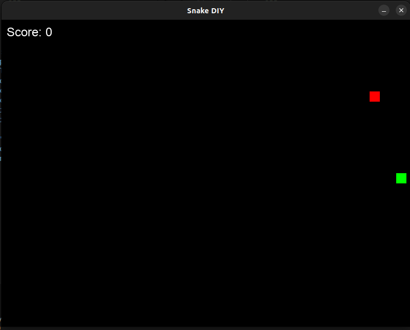

# Snake DIY



A classic Snake game developed in Python 3 using Pygame.

## Installation

1.  **Prerequisites**: Ensure you have Python 3 installed.
2.  **Install Pygame**:
    ```bash
    pip install pygame
    ```

## Running the Game

Run the game using the following command:

```bash
python3 main.py
```

## Configuration

You can customize the game settings in `config.json`.
- **window**: Set window size and title.
- **colors**: Set RGB colors for snake, food, background, and text.
- **game**:
    - `speed`: Base speed of the snake.
    - `block_size`: Size of each grid block.
    - `solid_walls`: `true` for game over on wall hit, `false` for wrap-around.
    - `score_per_move`: Points earned per move.
    - `score_per_food`: Points earned per food eaten.
    - `pixel_movement`: `true` for smooth movement, `false` for grid-based.
    - `pixel_speed`: Speed in pixels per frame (for smooth movement).
- **audio**: Enable/disable sound and set volume.

## Controls

- **Arrow Keys**: Move the snake.
- **Same Direction**: Hold the key for the current direction to accelerate.
- **P**: Pause/Resume game.
- **L**: Toggle Leaderboard (pauses game).
- **R**: Restart game (when Game Over).
- **ESC**: Quit game.

## Features

- **Smooth Movement**: Pixel-based movement for a fluid experience (configurable).
- **Leaderboard**: Top 10 scores with player names saved to `leaderboard.json`.
- **Multiple Food**: Food count increases as your score gets higher.
- **Precise Growth**: Snake grows exactly one block per food item.
- **Sound Effects**: Support for `assets/eat.wav`.
- **Configurable**: Customize colors, speed, window size, and more in `config.json`.
